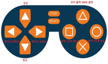
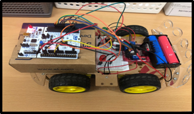
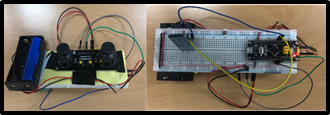

## Team-Project_RC-Car-App-Joystick

### 1. 목적
- STM32를 기반으로 한 RC카 제작을 통해 STM32 MCU, 블루투스, 조이스틱 조작 및 이해

  

### 2. 프로젝트의 목표
- 어플을 통한 RC카 수동 제어 구현
- 조이스틱을 통한 RC카 수동 제어 구현
- RTOS을 통한 RC카와 LED 동시 제어 구현

  

### 3. Hardware Diagram

  
 -> RC카의 하드웨어 구상도 

  
  
 -> 조이스틱의 하드웨어 구상도 

  

  

### 4. System Diagram

  
 -> 어플을 통한 제어 시스템의 구상도 

  
  
 -> 조이스틱을 통한 제어 시스템의 구상도 

  

  

### 5. 프로젝트 구현

  
   
  
   
  

  
